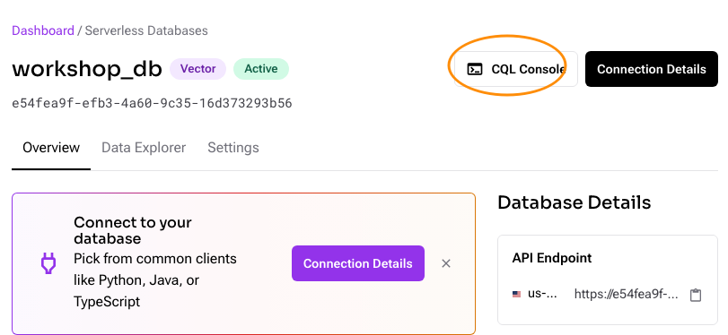

# Astra DB ワークショップ

Astra DBは、動的なスケーリングと高い可用性を誇るサーバーレスデータベースサービスであり、Apache Cassandra®の力をクラウド環境にもたらします。運用負荷を大幅に削減し、迅速なアプリケーションデプロイメントを可能にします。本ワークショップでは、Astra DBの基本とその強力な機能について学びます。

## Astra アカウント作成方法

Astra DB を利用するためのアカウント作成方法について説明します。
DataStax の Langflow や生成 AI のためのデータを保存する Astra DB を利用する場合は DataStax のアカウントが必要です。[DataStax のウェブサイト](https://www.datastax.com/)にアクセスしてアカウントを作成します。
<p align="center">

</p>

画面中央の SIGN UP FOR FREE や 右上の TRY FOR FREE をクリックしてアカウント作成画面に移動します。左側に必要事項を記入するフォームが現れます。入力を完了すると、指定したメールアドレスに、メールアドレスが正しいかどうかを確認するメールが届きます。期限が決まっているので、期限内にクリックすると登録は完了です。利用できる量やリージョンなどに制限があったりしますが無料で使えます（クレジットカード登録不要）。
<p align="center">

</p>

Datastax のウェブサイトの右上にある Sign In からログインします。

## データベースの作成

ログインすると以下のような画面があらわれます。


<p align="center">

</p>

中央下のほうへスクロールダウンして、Create a Database をクリックするとデータベース作成画面に移動します。

<p align="center">

</p>

Serverless (Vector)、Serverless (Non-Vevtor) を選択できますが、Serverless (Vector) は、その後の設定で Vector をサポートした Collection (半構造化データを保存可能なテーブル) と、non-Vectorのみをサポートする Collection を作成することができます。
Serverless (Vector) 、お好みのクラウドプロバイダ、リージョンを選んでデータベースを作成します。

## Collection (コレクション) の作成

DBの作成が完了すると以下のような画面が表示されます。この画面では、DBへのアクセスに関するメトリクス情報 (中央) や、接続のためのエンドポイントの情報 (右側) が表示されます。

<p align="center">

</p>

Data Explorer のタブに移動して、コレクションを作成します。


<p align="center">

</p>

Collection name を指定し、Vector形式を有効とするかしないか (Vector-enabled collection) を選択します。いずれの場合も、コンソールから作成した場合は、
Insert されるデータは json 形式に変換され、`doc_json` というカラムに追加されます。データを追加した際に、

<p align="center">

</p>

## CQL を使ったデータベースの操作

右上の CQL Console のボタンから CQL を実行するためのシェルを起動することができます。

<p align="center">

</p>

例えば、以下の CQL コマンドをうつことで、作成されたコレクションの構造およびメタデータに関する詳細情報をみることができます。
<collection_name> は作成したコレクション名に置き換えてください。タブキーによる補完が可能です。

```
DESCRIBE TABLE default_keyspace.<collection_name>;
```

## データの追加

データを追加する際は CQL から insert コマンドを実行することも可能ですが、コンソールからアップロードすることも可能です。
PDF や JSON/CSVのファイルを用意して、もとのコレクションの画面に戻り、以下の画面から Load Data を選んでアップロード画面からアップロードできます。
PDF は同時に10ファイル1GBまで、JSON/CSV ファイルは100MBまで一度にアップロードできます。(Non-Vector の場合は CSV/JSONのみです)

<p align="center">

</p>

アップロードするとコンソール上でデータを確認することができます。
US の Data.Gov にある [Air Quality](./dataset/Air_Quality.csv) のデータを一部修正 (列名に許容されていないスペースを削除したもの)をアップロードしてみましょう。

## データの検索

Hybrid Search の項目で列名と値を指定した検索を行うことができます。

<p align="center">

</p>
